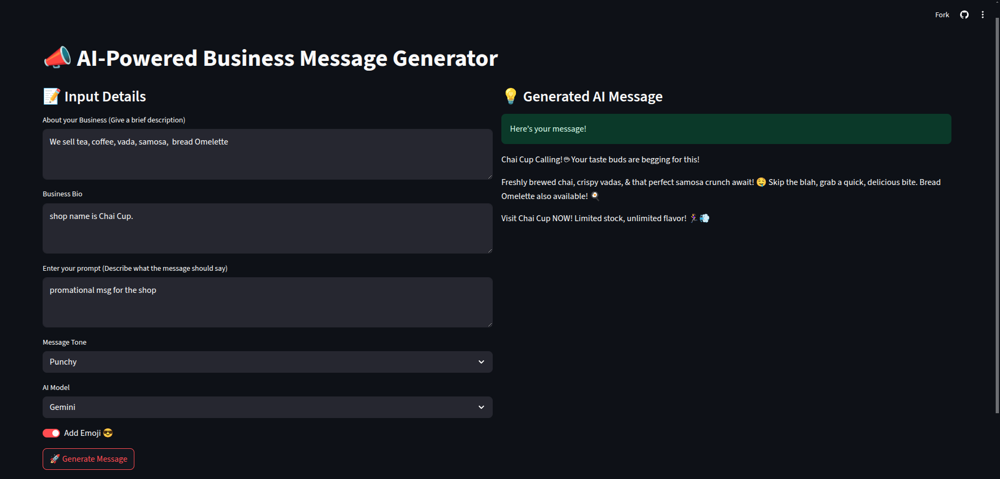

# 📣 AI Business Message Generator

An AI-powered web app built with **Streamlit** that helps businesses generate engaging, on-brand messages for marketing, customer outreach, and promotions using **Google Gemini** or **OpenAI ChatGPT**.

> 🔑 API keys are entered securely through the UI — no need for environment variables.

---

## 🚀 Features

- ✨ Generate business messages in various tones (Punchy, Humorous, Creative, Minimal, Informal)
- 🤖 Choose between **Gemini (Google)** or **OpenAI GPT** models
- 📝 Customize input: business description, bio, and message goal
- 😎 Optional emoji toggle for fun, modern messaging
- 💡 Fast and simple UI built with Streamlit


---

## 🎯 Live Demo

👉 [Click here to try the app!](https://ai-business-message-generator.streamlit.app/)


 

---


## 🔧 Setup & Installation

### 1. Clone the Repository

```bash
git clone https://github.com/yourusername/ai-business-message-generator.git
cd ai-business-message-generator
````

### 2. Install Dependencies

Make sure Python 3.8+ is installed.

```bash
pip install -r requirements.txt
```

### 3. Run the App

```bash
streamlit run app.py
```
---

## 🔐 API Keys

You’ll be prompted to enter:

* **OpenAI API Key** (get from [https://platform.openai.com/api-keys](https://platform.openai.com/api-keys))
* **Google API Key** (for Gemini, from [https://aistudio.google.com/app/apikey](https://aistudio.google.com/app/apikey))

No `.env` file is required — API keys are handled directly in the UI.

---


## 🛠 Tech Stack

* **Frontend/UI**: Streamlit
* **AI Models**: Google Gemini, OpenAI GPT
* **LangChain**: for LLM chaining and prompt management
* **Python**: core backend

---
